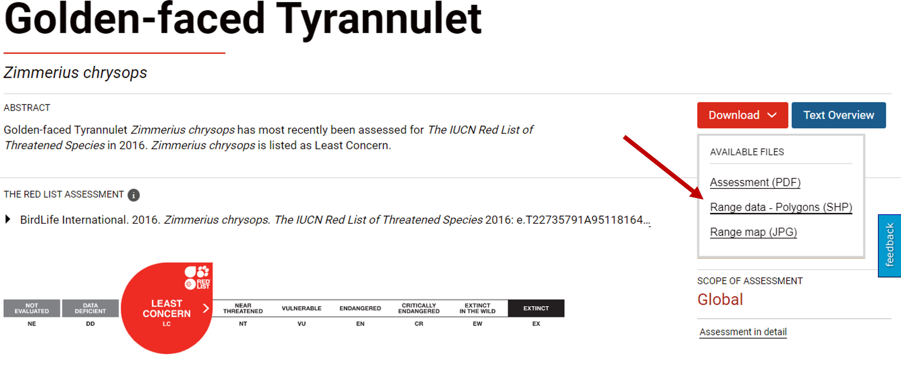

The following workflow is designed to facilitate and streamline the scoping analysis for KBA identification by leveraging the free and open access data of GBIF. 

The workflow is divided into three main steps:

1. [Select the species in the study area that could potentially trigger KBA criteria.](#first)

2. [Identify the sites where the potential trigger species occur in significant numbers.](#second)

3. [Cite the sources of information used.](#third)

You may want to add/remove steps or modify the code based on your interests.

Before running the code, I recommend visiting this [link](https://portals.iucn.org/library/sites/library/files/documents/2016-048.pdf) and familiarizing yourself with the different KBA criteria and their associated thresholds. 

# Setup 

```{r setup, echo=FALSE}
knitr::opts_chunk$set(echo = TRUE, warning = FALSE)
knitr::opts_knit$set(root.dir = rprojroot::find_rstudio_root_file())
```


Load the libraries

```{r load libraries, message=FALSE, warning=FALSE}
library(tidyverse)      # To do data wrangling 
library(Hmisc)          # To use the %nin% binary operator 
library(rgbif)          # To access records through the GBIF API
library(wellknown)      # To handle Well Known Text Objects
library(rredlist)       # To access IUCN information
library(ggplot2)        # To create graphics
library(ggspatial)      # To add north arrows and annotation scales to ggplot maps
library(RCurl)          # To compose HTTP requests
library(xml2)           # To work with HTML and XML
library(rvest)          # To download and manipulate HTML and XML
library(sf)             # To work with vector data
library(sp)             # To work with vector data
library(DT)             # To display tables in the notebook
library(leaflet)        # To make interactive maps 
library(knitr)          # To knit the document
library(foreach)        # For parallelization of loops
library(doSNOW)         # For parallelization of loops
library(parallel)       # For parallelization of loops
library(stringi)        # To remove special characters of species common names
library(CoordinateCleaner) # To flag  potentially problematic coordinate records
library(countrycode)    # For turning country codes into  ISO-3 country codes
library(taxadb)         # To find species accepted names
```


Define initial configuration parameters 

```{r initial parameters}
# Increase the time allowed to access URLs
curlSetOpt(timeout = 100000)
# Disable scientific notation
options(scipen=999)
```


To access GBIF data, you must have an account on the platform. If you do not have one, create it by entering the following [link](https://www.gbif.org/user/profile). Additionally, to access IUCN information, you must request an API key [here](https://apiv3.iucnredlist.org/).

Once you have both the account and the API key, you can define new variables to store them. The following are just examples that you can replace with your information. 

```{r user info example, eval=FALSE}
GBIF_USER <- "pp"
GBIF_PWD <- "pphh"
GBIF_EMAIL <- "pp@gmail.com"
IUCN_REDLIST_KEY = "12345"
```


# 1. Select potential trigger species {#first}

**1.1.** The first thing we will do is download the occurrence records present in our study area. Save the shapefile of your study area in the data folder. For this example, we will focus the scope analysis on the department of Quindío in Colombia. 


```{r load study area}
# Load shapefile of the study area  
st_area <- st_read("data/Quindio.shp", quiet = TRUE)

# Convert shapefile into a Well Known Text object (WKT)
wkt <- wellknown::sf_convert(st_area)
```

You can also set additional conditions for the data you want to download. Since we are going to explore the spatial location of potential trigger species, I will only download records that have coordinates. Also, I will only use records taken recently.

```{r request GBIF records}
# Download GBIF records
download <- occ_download(
  
  # Records with coordinates
  pred("hasCoordinate", TRUE), 
  
  # Records taken between 2017 and 2021
  pred_gte("year", 2017), 
  pred_lte("year", 2022),  
  
  # Records that fall within the study area
  pred_within(wkt),
  
  # Records that fall within Colombia
  pred("country", "CO"), 
  
  # Format of the resulting file 
  format = "SIMPLE_CSV",
  
  # GBIF account information
  user = GBIF_USER, 
  pwd = GBIF_PWD, 
  email = GBIF_EMAIL)
```

After submitting the download request to GBIF, we must wait a few minutes for it to be accepted.

```{r download status}
# Check download status
occ_download_meta(download)$status
```

Once the request status is successful, we can download the data

```{r download data, message=FALSE}
# download the data 
z <- occ_download_get(download, path = "data/", overwrite = TRUE)
```

```{r import GBIF data}
# Import data to an R dataset
data <- occ_download_import(z)
```

Now, we will plot the study area and the records downloaded from GBIF, to verify that all the points fall within our polygon of interest.

```{r map all points}
# Turn dataset into an sf object
data_sf <- st_as_sf(data, coords = c("decimalLongitude", "decimalLatitude"), crs = 4326)

# Plot points and study area
ggplot(data = st_area) +
  geom_sf() +
  xlab("Longitude") + ylab("Latitude") + # Change x and y labels 
  geom_sf(color = "black", fill = "grey") + # Change polygon and line color
  geom_sf(data=data_sf, color = 'green') + # Add occurrence records 
  annotation_scale() + # Add an annotation scale
  annotation_north_arrow(location='br') + # Add the north arrow to the bottom right
  ggtitle("Occurrence records that fall within the study area") # Add title to map 

# Remove variable
rm(data_sf)
```


**1.2**. We will now clean the occurrence dataset because this reduces the probability of including erroneous records and ensures that the data are suitable for the analysis (Gueta & Carmel, 2016). 


```{r initial records, echo=FALSE}
print(paste("Number of initial records:", nrow(data)))
```


```{r remove duplicates}
# Remove duplicates
data_wDuplicates <- data %>%
  
  # Remove records that have the same combination of the following variables 
  distinct(decimalLongitude,decimalLatitude,speciesKey,datasetKey,eventDate,individualCount,basisOfRecord, .keep_all = TRUE) 

# Remove previous dataset
rm(data)
```

```{r records without duplicates, echo=FALSE}
print(paste("Number of records without duplicates:", nrow(data_wDuplicates)))
```


Records obtained from GBIF may have issues and flags that indicate common quality problems. Therefore, it is important to explore the issues present in our dataset and remove the records that you consider inappropriate for the scoping analysis


```{r GBIF issues}
# Examine the GBIF issues present in our dataset
data_issues <- str_split(unique(data_wDuplicates$issue), ";") %>% 
  
  # Get a list of the issues present in the dataset 
unlist() %>% unique()
```


```{r GBIF issues definitions}
# Obtain the definition of the GBIF issues present in our dataset
GBIF_issues <- gbif_issues() %>%
  
  filter(issue %in% data_issues)

print(paste(GBIF_issues$issue, GBIF_issues$description))
```


If you want to delete records with specific problems, you can use the following example code. However, for this example, I will not delete any of the records with issues. 

```{r GBIF issues exclutions, eval=FALSE}

data_wIssues <- data_wDuplicates[which(grepl(paste(c("TAXON_MATCH_HIGHERRANK", "INSTITUTION_MATCH_NONE"), collapse = "|"), data_wDuplicates$issue) == FALSE), ]
```


```{r records without issues, echo=FALSE}
print(paste("Number of presence records after removing issues:", nrow(data_wDuplicates)))
```

The [coordinateCleaner package](https://cran.r-project.org/web/packages/CoordinateCleaner/index.html) also provides some tools to flag records with common spatial errors, such as records assigned to the centroid of a country or province, the headquarters of GBIF or other biodiversity institutions. We will use this package to flag suspicious records, but we will not delete any in this example. It is recommended that you further explore flagged records before removing them from the analysis.

```{r using coordinateCleaner}

# Turn into ISO-3 country codes
data_wDuplicates$countryCode <- countrycode(data_wDuplicates$countryCode, origin = 'iso2c', destination = 'iso3c')

# Identify records with potential spatial errors
data_wDuplicates <- clean_coordinates(x = data_wDuplicates,
                           lon = "decimalLongitude",
                           lat = "decimalLatitude",
                           countries = "countryCode",
                           species = "species",
                           tests = c("capitals", "centroids",
                                     "equal","institutions",
                                     "zeros", "countries")) 

```

You can use the following dataset called "flagged_records" to further explore the records with potential issues

```{r flagged records}

# Filter flagged records
flagged_records <- data_wDuplicates %>% filter(.summary == FALSE) %>% droplevels()

# Plot flagged and non-flagged records
ggplot(data = st_area) +
  geom_sf() +
  xlab("Longitude") + ylab("Latitude") + # Change x and y labels 
  geom_sf(color = "black", fill = "grey") + # Change polygon and line color
  geom_sf(data=(st_as_sf((data_wDuplicates %>% filter(.summary == TRUE) %>% droplevels()), coords = c("decimalLongitude", "decimalLatitude"), crs = 4326)),color = 'green') + # Add occurrence records that were not flagged
  geom_sf(data=(st_as_sf(flagged_records, coords = c("decimalLongitude", "decimalLatitude"), crs = 4326)),color = 'red') + #Add flagged records
  annotation_scale() + # Add an annotation scale
  annotation_north_arrow(location='br') + # Add the north arrow to the bottom right
  ggtitle("Flagged occurrence records in red") # Add title to map 
```


Next, we will remove the records that are not identified at least at the species level, because the thresholds associated with the species-based criteria are designed to be applied at this taxonomic level (KBA Standards and Appeals Committee, 2020). 

We will also delete the absence records, as they do not provide information on the species present in the study area.

```{r species level}
data_spLevel <- data_wDuplicates %>% 
  
  # Select the records where the taxon rank is at least species 
  filter(taxonRank == "SPECIES" | taxonRank == "SUBSPECIES" | taxonRank == "VARIETY") %>% 
  
  # Select presence records
  filter(occurrenceStatus == "PRESENT") %>%
  
  # drop levels
  droplevels()

# Remove previous dataset
rm(data_wDuplicates)
```

```{r records species level, echo=FALSE}
print(paste("Number of records identified at least at the species level:", nrow(data_spLevel)))
```


The taxonomy used for KBA identification should be consistent with the taxonomic backbone of the IUCN Red List, i.e., the Species Information Service, SIS (KBA Committee on Standards and Appeals, 2020). Thus, we will exclude records with unrecognized species names based on the IUCN Red List assessments.

In addition, we will eliminate the records of species introduced (non-native) in our study area since these cannot trigger KBAs (KBA Committee on Standards and Appeals, 2020). 

```{r species table}
# Create a table with the species names present in the occurrence dataset
list_species <- data_spLevel %>% 
  
  # Get unique species names 
  distinct(species, .keep_all = TRUE) %>% 
  
  # Keep species taxonomy
  select(kingdom, class, order, family, species) 

```


```{r total species, echo=FALSE}
print(paste("Number of species:", length(unique(data_spLevel$species))))
```

The following chunk is a parallelized loop that uses several of your computer's cores to speed up the process of finding the species names under the IUCN taxonomic backbone. By default, it uses the total number of cores on your computer minus 2. If you want to change this, modify the variable called "cl". 


```{r retrieve species IUCN names, warning=FALSE, message=FALSE}

# Create a cluster
cl <- makeCluster(detectCores()-2)
# Register the cluster
registerDoSNOW(cl)
# Define the number of iterations
iterations <- length((1:nrow(list_species)))
# Create a progress bar based on the number of iterations
pb <- txtProgressBar(max = iterations, style = 3)
progress <- function(n) setTxtProgressBar(pb, n)
opts <- list(progress = progress)


join1 <- foreach(i = (1:nrow(list_species)),
                .combine = rbind,
                .options.snow = opts, 
                .packages = "rredlist") %dopar%
  {
    
    species <- list_species$species[i]
    
    # Verify if the species name is a synonym of the IUCN accepted name
    x <- rl_synonyms(name =  species, key = IUCN_REDLIST_KEY, parse = TRUE)
    
    # If there are no synonyms 
    if (length(x$result) == 0) {
      # then leave the original name 
      IUCN_name <- x$name[1]
    } else {
      # otherwise extract the IUCN accepted name 
    IUCN_name <-  x$result$accepted_name[1]
    }
    
    # Slow down the loop for 3 seconds as too many frequent calls can temporarily block access to the IUCN API
    Sys.sleep(3)

# Use another rredlist function to find out if the name has any information associated with it or if it can't be found
    
  x2 <- rl_occ_country(IUCN_name, key = IUCN_REDLIST_KEY, parse = TRUE)

  #If there is no info, it could be because the species name does not have a red list assessment. This could be checked manually. 
  
  if ((x2$count) == 0) {
    IUCN_name <- "CHECK"
    }
  
  # Slow down the loop for 3 seconds as too many frequent calls can temporarily block access to the IUCN API
  Sys.sleep(3)
  
  # Retrieve results
results <- data.frame(cbind(species, IUCN_name))
return(results)
  }

```

For the  names that could not be recognized using the IUCN API, we will search for the accepted name under the Integrated Taxonomic Information System.


```{r itis accepted name, warning=FALSE, message=FALSE}

# Create a local copy of the Integrated Taxonomic Information System database
taxadb::td_create("itis")

# Create new field to store ITIS accepted name
join1 <- join1 %>% mutate(ITIS_name = NA)

# Retrieve the ITIS accepted name for the species that were not recognized by the IUCN API
for (i in (which(join1$IUCN_name == "CHECK"))){
  # Find the accepted species name under the Integrated Taxonomic Information System
  join1$ITIS_name[i] <- taxadb::filter_name(join1$species[i])  %>%
    mutate(acceptedNameUsage = get_names(acceptedNameUsageID)) %>%
    select(acceptedNameUsage) %>% pull() %>% as.character()
  
  # If the name is not found, leave "CHECK"
  if (is.na(join1$ITIS_name[i])){
    join1$ITIS_name[i] <- "CHECK"
  }
}

# Apply loop to the species that were not recognized by the IUCN API 
# and where the ITIS accepted name is different from name recorded in the GBIF dataset
# Define the number of iterations
iterations <- length(which(!is.na(join1$ITIS_name) & join1$ITIS_name != "CHECK" & join1$ITIS_name != join1$species))
# Create a progress bar based on the number of iterations
pb <- txtProgressBar(max = iterations, style = 3)
progress <- function(n) setTxtProgressBar(pb, n)
opts <- list(progress = progress)

# Search for IUCN accepted names for those spcies where the ITIS accepted name 
# is different from the name recorded in the GBIF dataset
join1.1 <- foreach(i = (which(!is.na(join1$ITIS_name) & join1$ITIS_name != "CHECK" & join1$ITIS_name != join1$species)),
                .combine = rbind,
                .options.snow = opts, 
                .packages = "rredlist") %dopar%
  {
    
    species <- join1$species[i]
    ITIS_name <- join1$ITIS_name[i]
    
    # Verify if the species name is a synonym of the IUCN accepted name
    x <- rl_synonyms(name =  ITIS_name, key = IUCN_REDLIST_KEY, parse = TRUE)
    
    # If there are no synonyms 
    if (length(x$result) == 0) {
      # then leave the original name 
      new_IUCN_name <- x$name[1]
    } else {
      # otherwise extract the IUCN accepted name 
    new_IUCN_name <-  x$result$accepted_name[1]
    }
    
    # Slow down the loop for 3 seconds as too many frequent calls can temporarily block access to the IUCN API
    Sys.sleep(3)

#Use another rredlist function to find out if the name has any information associated with it or if it can't be found
    
  x2 <- rl_occ_country(new_IUCN_name, key = IUCN_REDLIST_KEY, parse = TRUE)

  #If there is no info, it could be because the species name does not have a red list assessment. This could be checked manually. 
  
  if ((x2$count) == 0) {
    new_IUCN_name <- "CHECK"
    }
  
  # Slow down the loop for 3 seconds as too many frequent calls can temporarily block access to the IUCN API
  Sys.sleep(3)
  
  # Retrieve results
results <- data.frame(cbind(species, new_IUCN_name))
return(results)
  }

# Join results 
join1 <- full_join(join1, join1.1, by = "species") %>%
  mutate(IUCN_name = case_when(IUCN_name != new_IUCN_name & !is.na(new_IUCN_name) ~ new_IUCN_name,
                               TRUE ~ IUCN_name)) %>% 
  select(species, IUCN_name)

# Remove temporary dataset
rm(join1.1)

# Stop cluster
stopCluster(cl)
```

```{r number of species without IUCN name, echo=FALSE}
print(paste("Number of species without an IUCN name: ", length(which(join1$IUCN_name == "CHECK")), sep = " "))

print(paste("Number of species with an IUCN name: ", length(which(join1$IUCN_name != "CHECK")), sep = " "))

```

```{r join results first phase}

# Include the IUCN name to the GBIF dataset
data_spLevel <- full_join(data_spLevel, join1, by = "species") %>%
  filter(IUCN_name != "CHECK") %>%
  droplevels()

```

To identify whether occurrences are native or exotic/introduced to our study area, we will use spatial data associated with global Red List assessments which describe native and alien ranges of species.If you are only considering one species in this scoping exercise, you can download its distribution polygon from its assessment website. For example if you want to download the distribution of the species *Zimmerius chrysops*, you can do it from this [website](https://www.iucnredlist.org/species/22735791/95118164)

```{r IUCN distribution, fig.cap="How to download species distributions from their assessment webiste", echo=FALSE, out.width = '75%', fig.align="center"}

```


If you are analyzing several species you can download the distribution polygons for large taxonomic groups from this [website](https://www.iucnredlist.org/resources/spatial-data-download). Please note that for bird species you must request a copy of the shapefiles from Birdlife International and this may take several days.

In this example we will focus only on birds and terrestrial mammals. 

We will also use the distributions of the global Red List assessments to extract the seasonality of occurrence records. For example, to identify whether the occurrences of migratory species are within the breeding or non-breeding ranges.

*Note: Since files containing distributions for large taxonomic groups are very heavy, I recommend clipping them to a smaller extent before uploading them to R to increase performance.*


```{r native species, warning=FALSE, message=FALSE}

# Load polygons for the different groups 
terrestrial_mammals <- st_read("./data/distributions/MAMMALS_TERRESTRIAL_CLIP.shp", quiet = TRUE)
birds <- st_read("./data/distributions/Birdlife_distributions_clip.shp", quiet = TRUE)

# Select origin and seasonal fields
birds <- birds %>% rename(binomial = sci_name) %>% select(binomial, origin, seasonal, citation)

terrestrial_mammals <- terrestrial_mammals %>% 
  select(colnames(birds))

# Merge everything into the same dataset
distributions <- rbind(terrestrial_mammals, birds)

# Remove non-merged polygons
rm(terrestrial_mammals, birds)

# Remove polygons of species that are not recorded in the study area
distributions <- distributions[which(distributions$binomial %in% data_spLevel$IUCN_name), ]

# Remove occurrences of species that do not have a distribution
data_spLevel <- data_spLevel %>% filter(IUCN_name %in% unique(distributions$binomial)) %>% droplevels()

# Create a table with the resulting species names 
list_species <- data_spLevel %>% 
  
  # Get unique species names 
  distinct(IUCN_name, .keep_all = TRUE) %>% 
  
  # Keep species taxonomy
  select(kingdom, class, order, family, IUCN_name)

# Create a cluster
cl <- makeCluster((detectCores() - 2))
# Register the cluster
registerDoSNOW(cl)
# Define the number of iterations
iterations <- nrow(list_species)
# Create a progress bar based on the number of iterations
pb <- txtProgressBar(max = iterations, style = 3)
progress <- function(n) setTxtProgressBar(pb, n)
opts <- list(progress = progress)


data_native <- foreach(i = 1:iterations,
                .combine = rbind,
                .options.snow = opts, 
                .packages = c("dplyr", "sf")) %dopar%
    {
      
      # Turn off the s2 processing
      sf::sf_use_s2(FALSE)
      
      # Create a spatial dataframe of the species
      occurrences <- data_spLevel %>%
      dplyr::filter(IUCN_name == list_species$IUCN_name[i]) %>%
      droplevels() %>% 
      sf::st_as_sf(coords = c("decimalLongitude", "decimalLatitude"), crs = 4326)
      
      # Extract the distribution of that species
      ranges <- distributions[which(distributions$binomial == list_species$IUCN_name[i]), ]
      
      # Intersect points(records) and distribution
      result <- sf::st_intersection(occurrences, ranges) %>%
      
      # Define origin of records
      dplyr::mutate(origin = case_when(origin == 1 ~ "Native",
                                origin == 2 ~ "Reintroduced", 
                                origin == 3 ~ "Introduced", 
                                origin == 4 ~ "Vagrant", 
                                origin == 5 ~ "Origin Uncertain", 
                                origin == 6 ~ "Assisted Colonisation"),
             
                    # Define seasonality of records
             seasonal = case_when(seasonal == 1 ~ "Resident", 
                                  seasonal == 2 ~ "Breeding Season", 
                                  seasonal == 3 ~ "Non-breeding Season", 
                                  seasonal == 4 ~ "Passage", 
                                  seasonal == 5 ~ "Seasonal Occurrence Uncertain")) %>%
        
        # Create coordinates fields
        dplyr::mutate(decimalLongitude = sf::st_coordinates(.)[,1],
           decimalLatitude = sf::st_coordinates(.)[,2]) %>%
      
        # Turn to non-spatial dataframe
      as.data.frame()
      
      # Retrieve result
      return(result)
    
    }


# Stop cluster
stopCluster(cl)

# Remove distributions
rm(distributions)

# Remove non-native species
data_native <- data_native %>% 
  filter(origin == "Native" | origin == "Reintroduced") %>% 
  droplevels() %>% 
  select(-c(binomial, geometry))

```


```{r free memory, message=FALSE}
# Free unused R memory
gc() 
```


```{r number native species, echo=FALSE}

print(paste("Number of native species: ", length(unique(data_native$IUCN_name)), sep = " "))

```

```{r location native species}

# Plot native records and removed records (Species records that fall outside their respective distributions are removed in the previous step)

ggplot(data = st_area) +
  geom_sf() +
  xlab("Longitude") + ylab("Latitude") + # Change x and y labels 
  geom_sf(color = "black", fill = "grey") + # Change polygon and line color
  geom_sf(data=(st_as_sf((data_spLevel %>% filter(occurrenceID %nin% data_native$occurrenceID) %>% droplevels()), coords = c("decimalLongitude", "decimalLatitude"), crs = 4326)),color = 'red') + #Add removed records
  geom_sf(data=(st_as_sf((data_native), coords = c("decimalLongitude", "decimalLatitude"), crs = 4326)),color = 'green') + # Add occurrence records of native species
  annotation_scale() + # Add an annotation scale
  annotation_north_arrow(location='br') + # Add the north arrow to the bottom right
  ggtitle("Occurrences of native species (removed records in red)") # Add title to map 

```


With the resulting table, we can easily identify the species that have a red list assessment and are considered native to our study area. 

```{r native species preview, echo = FALSE}
# Show preview of the resulting table 
datatable((data_native %>% select(kingdom, phylum, class, order, family, genus, species, IUCN_name, origin, seasonal, decimalLongitude, decimalLatitude) %>% arrange(IUCN_name)), caption = "Table 1: preview of the table used to compare GBIF and IUCN taxonomy and to identify the origin and seasonality of each species record", rownames = FALSE, filter="top", options = list(pageLength = 5, scrollX=TRUE))

```


**1.3.** We will now identify the species that could potentially trigger KBA criteria, specifically criteria A1 (for threatened species), B2 (for co-occurring geographically restricted species), and D1 (for demographic aggregations).

For criterion A1 we will identify threatened species (Vulnerable, Endangered and Critically Endangered) based on the IUCN Red List assessments.

```{r IUCN category, warning=FALSE, message=FALSE}

# Remove previous dataset
rm(data_spLevel)

# Create a table with the resulting species names 
list_species <- data_native %>% 
  
  # Get unique species names 
  distinct(IUCN_name, .keep_all = TRUE) %>% 
  
  # Keep species taxonomy
  select(kingdom, order, family, IUCN_name)

# Create a cluster
cl <- makeCluster((detectCores() - 2))
# Register the cluster
registerDoSNOW(cl)
# Define number of iterations
iterations <- nrow(list_species)
# Create progress bar
pb <- txtProgressBar(max = iterations, style = 3)
progress <- function(n) setTxtProgressBar(pb, n)
opts <- list(progress = progress)

join2 <- foreach(i = 1:iterations,
               .combine = rbind,
               .options.snow = opts, 
               .packages = "rredlist") %dopar%
  {
    # Search for IUCN assessment
    x <- rl_search(name =  list_species$IUCN_name[i], key = IUCN_REDLIST_KEY, parse = TRUE)
    
   # Fill in a table with the information retrieved
  IUCN_name <- x$result$scientific_name
  commonName  <- x$result$main_common_name
  global_RedListCategory <- x$result$category
  redList_Criteria <- x$result$criteria
  
  # Slow down the loop for 3 seconds as too many frequent calls can temporarily block access to the IUCN API
  Sys.sleep(3)

  result <- data.frame(cbind(IUCN_name, commonName, global_RedListCategory, redList_Criteria))
  return(result)
}

# Stop cluster
stopCluster(cl)

```

```{r join results second phase}

# Add info to GBIF dataset
data_native <- full_join(data_native, join2, by = "IUCN_name")  
```


```{r second graph, fig.align = 'center'}

# Create a table with the number of species per IUCN category
Second_graph <- (data.frame(table(join2$global_RedListCategory)) %>%
  rename(Category = Var1)) 
  
  # Add a row that sums the count for categories LC and LR/lc
Second_graph <- Second_graph %>%
  
  # Add a row that sums the count for categories LC and LR/lc
  add_row(Category = "LC or LR/lc", Freq = sum(Second_graph$Freq[which(Second_graph$Category == "LC")], Second_graph$Freq[which(Second_graph$Category == "LR/lc")])) %>%
  
  # Remove the rows of the categories of LC and LR/lc
  filter(Category %nin% c("LC", "LR/lc")) %>% droplevels()

# Plot
ggplot(Second_graph, aes(x=Category, y=Freq, fill=Category)) +
  geom_bar(stat="identity")+theme_minimal() +
  
  # Change order of levels
  scale_x_discrete(limits=c("LC or LR/lc", "NT", "VU", "EN", "CR", "DD")) + 
  
  # Change x label
  xlab("Red list category") + 
  
  # Add label with the number of species
  geom_text(aes(label=Freq), position=position_dodge(width=0.9), vjust=-0.25) +
  
  # Change y label
  ylab("Number of species")


```

For criterion B2 we will identify range-restricted species using the list provided by the KBA [website](http://www.keybiodiversityareas.org/working-with-kbas/proposing-updating/criteria-tools). Use that link to download the file, remove the merged rows that provide contextualization information, and save to your data folder as a csv file.

```{r KBA list}
# Load list of geographically restricted species
Range_restricted_species <- read.csv("./data/Restricted_range_species_B2_June2021_web.csv", stringsAsFactors = FALSE, sep = ";") %>% 
  
  # Select the fields of interest
  select(binomial, Range.type) %>% 
  
  # Rename them, so they are the same as the ones of the GBIF dataset
  rename(IUCN_name = binomial, seasonal = Range.type) %>% 
  
  # Create a field holding the combination of the species and the seasonal range type
  mutate(seasonal.combination = paste(IUCN_name, seasonal, sep = "|"))
```


```{r range-restricted}

# Identify the species that appear in the geographically restricted species list with the proper seasonal range
data_native <- data_native %>% 
  
  mutate(seasonal.combination = paste(IUCN_name, seasonal, sep = "|")) %>%
  
  mutate(geographicallyRestricted = case_when(seasonal.combination %in% Range_restricted_species$seasonal.combination ~ seasonal, 
                                              TRUE ~ NA_character_)) %>%
  
  select(-seasonal.combination)

```


```{r third graph, fig.align = 'center'}
# Create table with the number of range-restricted species
Third_graph <- data_native %>% distinct(IUCN_name, seasonal, .keep_all = TRUE) 
Third_graph <- data.frame(table(Third_graph$geographicallyRestricted, useNA = "ifany")) %>%
  rename(Type = Var1)

# Plot number of species that are range restricted
ggplot(Third_graph, aes(x=Type, y=Freq, fill=Type)) +
  geom_bar(stat="identity")+theme_minimal() +
  
  # Add label with the number of species 
  geom_text(aes(label=Freq), position=position_dodge(width=0.9), vjust=-0.25) +
  
  # Change y label
  ylab("Number of species")


```


Criterion D1 is suitable for application to migratory species that form seasonal aggregations (KBA Standards and Appeals Committee, 2020). Therefore, we will identify migratory birds, and then we will have to verify if they congregate in our study area, using, for example, expert knowledge. We will use the [Birdlife Data Zone](http://datazone.birdlife.org/home) to identify the migratory birds. 

```{r migratory birds, warning=FALSE, message=FALSE}

# Remove accents from species common names
data_native <- data_native %>%
  mutate(commonName = stri_trans_general(commonName, "Latin-ASCII"))

# Create a table with the resulting species names 
list_species <- data_native %>% 
  
  # Get unique species names 
  distinct(IUCN_name, .keep_all = TRUE) %>% 
  
  # Keep species taxonomy
  select(kingdom, class, order, family, IUCN_name, commonName)

# Create a cluster
cl <- makeCluster((detectCores() - 2))
# Register the cluster
registerDoSNOW(cl)
# Create a vector with the index of species that are birds
Aves <- which(list_species$class == "Aves")

# Define number of iterations
iterations <- length(Aves)

# Create progress bar
pb <- txtProgressBar(max = iterations, style = 3)
progress <- function(n) setTxtProgressBar(pb, n)
opts <- list(progress = progress)

join3 <- foreach(i = Aves,
               .combine = rbind,
               .options.snow = opts, 
               .packages = c("RCurl", "xml2", "rvest")) %dopar%
  {
    # Specify the birdlife base url
  base_url <- paste("http://datazone.birdlife.org/species/factsheet/")
  
  # Create a character vector with the name of the species that will be included in the url (everything must be in lower case and without special characters)
  species_url <- paste(tolower(stringr::str_replace_all((stringr::str_replace_all(stringr::str_trim(list_species$commonName[i], side = "both"), "[^[:alnum:][:blank:]+-]", "")), " ", "-")), 
                       tolower(stringr::str_replace_all(list_species$IUCN_name[i], " ", "-")), sep = "-")
  
  # Paste base url with species name
  complete_url <- paste0(base_url, species_url)
  
  # Add a /details at the end, to access to the "Data table and detailed info" tab of the birdlife webpage 
  complete_url <- paste0(complete_url, "/details")
  
  # Turn HTML document into XML
  html  <- read_html(complete_url)
  
  migratory <- html %>% html_nodes("table") %>% 
    
    # Extract table that has information on migratory status 
    .[3] %>% html_table(fill = TRUE) %>%
    
    # Extract migratory status 
    as.data.frame() %>% .[1,2]
  
  IUCN_name <- list_species$IUCN_name[i]
  
  result <- data.frame(cbind(IUCN_name, migratory))
  
  return(result)

  }

# close connection
stopCluster(cl)

```

```{r join migratory results}

# Add migratory status to GBIF dataset
data_native <- full_join(data_native, join3, by = "IUCN_name")  

```


```{r fourth graph, fig.align = 'center'}

# Create a table with the number of migratory bird species
Fourth_graph <- data.frame(table(join3$migratory)) %>%
  rename(Type = Var1)

# Plot number of migratory bird species
ggplot(Fourth_graph, aes(x= reorder(Type, -Freq) , y=Freq, fill=Type)) +
  geom_bar(stat="identity")+ theme_minimal() +
  
  # Add label with the number of species 
  geom_text(aes(label=Freq), position=position_dodge(width=0.9), vjust=-0.25) +
  
  # Change y label
  ylab("Number of species") + 
  
  # Change x label
  xlab("Type of migrant")

```

```{r list of potential trigger species}

# Select the potential trigger species
ptrigger_species <- data_native %>%
  
  # Filter threatened, range-restricted and / or migratory species
  filter(global_RedListCategory %in% c("VU", "EN", "CR") | !is.na(geographicallyRestricted)  | migratory %nin% c(NA, "not a migrant")) %>%
  
  droplevels() %>%
  
  distinct(IUCN_name, seasonal, .keep_all = TRUE) %>%
  
  select(kingdom, phylum, class, order, family, genus, IUCN_name, commonName, origin, global_RedListCategory, redList_Criteria, geographicallyRestricted, migratory) %>%
  
  # Arrange by red list category
  arrange(global_RedListCategory)


```

<br><br><br><br>

<style>
div.blue { background-color:#e6f0ff; border-radius: 5px; padding: 20px;}
</style>
<div class = "blue">

**The following table shows the species that could potentially trigger KBA criteria in our study area.**

</div>


```{r list of potential trigger species number, echo=FALSE}
print(paste("Number of potential trigger species:", nrow(ptrigger_species)))
```


```{r list of potential trigger species table , echo=FALSE}
# Show preview of the resulting table 
datatable(ptrigger_species, caption = "Table 2: Species that could potentially trigger KBA criteria in the study area", rownames = FALSE, filter="top", options = list(pageLength = 5, scrollX=TRUE))
```


# 2. Identify the sites where the potential trigger species occur in significant numbers {#second}


**2.1** We will use a function that will help us to visually identify the sites where the potential trigger species have large counts or where there are multiple records of potential trigger species.

The function creates an interactive map showing the location of records that meet a user-defined threshold of individuals. It also allows to insert a grid and count the total number of records that belong to potential trigger species per cell, or the number of records that reach a count threshold per cell. The function also allows you to explore the spatial relationship between the points and a polygon different than the study area.


The arguments of the function are the following:

* *GBIFtable:* dataset. The clean GBIF occurrence dataset that includes the fields of IUCN_name, red list category, geographically restricted, and migratory status.

* *potential_triggerSpecies:* dataset. Table containing only the possible trigger species for criteria A1, B2 and D1.

* *study_area:* sf object. Polygon of the study area.

* *criteria:* character. It can be "A1", "B2", "D1" or empty if you want to include all three criteria.

* *selected_species:* character vector. Names of the potential trigger species you want to evaluate. It can be left empty if you want to evaluate all potential trigger species.

* *individualCount_filter:* number. Filter to include only records that reach a specific number of individuals. It can be left empty.

* *gridCell_Size:* number. Cell size for the grid in meters.

* *extra_polygon:* sf object. Another polygon that you want to add to the map.

For this example, I will evaluate the species that could trigger criterion A1 (threatened species), as they do not require any additional review of information. 

```{r select species to plot}

species_map <- ptrigger_species %>% 
  
  # Select endangered species 
  filter(global_RedListCategory %in% c("VU", "EN", "CR")) %>%
  
  # Export species names to a character vector 
  droplevels() %>% select(IUCN_name) %>% pull() %>% as.character()
  
```

```{r first function}

# Load a different polygon
polygon <- st_read("./data/IBAs_Quindio.shp", quiet = TRUE)

# Define function 
map_of_large_counts <- function(GBIFtable, study_area, criteria, selected_species, individualCount_filter, gridCell_Size, extra_polygon){
  
  
  # Select only the occurrence records of the potential trigger species
  dataset <- GBIFtable %>% 
    # Filter threatened, range-restricted and / or migratory species
  filter(global_RedListCategory %in% c("VU", "EN", "CR") | !is.na(geographicallyRestricted)  | migratory %nin% c(NA, "not a migrant")) %>%
  
  droplevels()
  
  # If there is no argument for the selected species, leave the table as is
  if (missing(selected_species)){
    dataset <- dataset
  } else {
    # Otherwise filter the selected species 
    dataset <- subset(dataset, species %in% selected_species) %>%
      droplevels()
  }
  
  # If there is no extra polygon, then assign the extra polygon as the study area
  if(missing(extra_polygon)){
    extra_polygon <- study_area
  } 
  
  
  # If the count filter is missing, then leave the table as is
  if (missing(individualCount_filter)){
    dataset2 <- dataset 
  } else {
    # otherwise apply the filter
    dataset2 <- dataset %>% 
      filter(individualCount >= individualCount_filter) %>%
      droplevels()
  }
  
  # Turn datasets into sf objects
  dataset <- st_as_sf(dataset, coords = c("decimalLongitude", "decimalLatitude"), crs = 4326)
  dataset2 <- st_as_sf(dataset2, coords = c("decimalLongitude", "decimalLatitude"), crs = 4326)
  
  # If the criteria parameter is missing, then the pop up for each record
  # will include information about the criteria A1, B2, D1. 
  if (missing(criteria)) {
    
    # Define pop up for each point
    pop_up1 <- paste("Species:", dataset$IUCN_name, "<br>",
                     "Red list category:", dataset$global_RedListCategory, "<br>",
                     "Range restricted status:", dataset$geographicallyRestricted, "<br>",
                     "Migratory status:", dataset$migratory, "<br>",
                     "Individual count:", dataset$individualCount)
    
    # Define pop up for each point
    pop_up2 <- paste("Species:", dataset2$IUCN_name, "<br>",
                     "Red list category:", dataset2$global_RedListCategory, "<br>",
                     "Range restricted status:", dataset2$geographicallyRestricted, "<br>",
                     "Migratory status:", dataset2$migratory, "<br>",
                     "Individual count:", dataset2$individualCount)
    
  } else {
    
    # If the criteria parameter is A1, then filter the datasets to only include threatened species and the pop up for each record will only include information about the red list category  
    
    if (criteria == "A1"){
      dataset <- subset(dataset, global_RedListCategory %in% c("VU", "EN", "CR"))
      dataset2 <- subset(dataset2, global_RedListCategory %in% c("VU", "EN", "CR"))
      
      # Define pop up for each point
      pop_up1 <- paste("Species:", dataset$IUCN_name, "<br>",
                       "Red list category:", dataset$global_RedListCategory, "<br>",
                       "Individual count:", dataset$individualCount )
      
      # Define pop up for each point
      pop_up2 <- paste("Species:", dataset2$IUCN_name, "<br>",
                       "Red list category:", dataset2$global_RedListCategory, "<br>",
                       "Individual count:", dataset2$individualCount )
      
    # If the criteria parameter is B2, then filter the datasets to only include range-restricted species and the pop up for each record will only include information about the range-restricted status    
    } else if (criteria == "B2"){
      dataset <- subset(dataset, !is.na(geographicallyRestricted))
      dataset2 <- subset(dataset2, !is.na(geographicallyRestricted))
      
      # Define pop up for each point
      pop_up1 <- paste("Species:", dataset$IUCN_name, "<br>",
                       "Range restricted status:", dataset$geographicallyRestricted, "<br>",
                       "Individual count:", dataset$individualCount )
      
      # Define pop up for each point
      pop_up2 <- paste("Species:", dataset2$IUCN_name, "<br>",
                       "Range restricted status:", dataset2$geographicallyRestricted, "<br>",
                       "Individual count:", dataset2$individualCount)
      
      # If the criteria parameter is D1, then filter the datasets to only include migratory species and the pop up for each record will only include information about the migratory status 
    } else if (criteria == "D1"){
      dataset <- subset(dataset, migratory %nin% c(NA, "not a migrant"))
      dataset2 <- subset(dataset2, migratory %nin% c(NA, "not a migrant"))
      
      # Define pop up for each point
      pop_up1 = paste("Species:", dataset$IUCN_name, "<br>",
                      "Migratory status:", dataset$migratory, "<br>",
                      "Individual count:", dataset$individualCount )
      
      # Define pop up for each point
      pop_up2 = paste("Species:", dataset2$species, "<br>",
                      "Migratory status:", dataset2$migratory, "<br>",
                      "Individual count:", dataset2$individualCount)
    }
    
  }
  
  
  # Create function to establish a different color for each species 
  factpal <- colorFactor(rainbow(length(unique(dataset$IUCN_name))), dataset$IUCN_name)
  
  # Project to Web Mercator to intersect with a grid 
  dataset_transform <- st_transform(dataset, 3857)
  dataset2_transform <- st_transform(dataset2, 3857)
  
  # Create grid 
  grid <- 
    
    # Find bounding box of the points
    st_as_sfc(st_bbox(dataset_transform)) %>% 
    
    # Make a grid within the bounding box, with the cell size in meters 
    st_make_grid(cellsize = gridCell_Size) %>% st_as_sf()
  
  # add count of points in each grid cell, based on an 
  # intersection between the points and the grid
  grid$count1 <- lengths(st_intersects(grid, dataset_transform)) 
  grid$count2 <- lengths(st_intersects(grid, dataset2_transform)) 
  
  # Create a list with the index (# of rows) of points that intersect with each site
  indexes1 <- st_intersects(grid, dataset_transform)
  indexes2 <- st_intersects(grid, dataset2_transform)
  
  # Using the list of indexes, extract the number of species and the species names of the points that intersect with each grid cell
  for (i in 1:nrow(grid)){
    grid$nspecies1[i] <- length(unique(dataset_transform$IUCN_name[indexes1[[i]]]))
    grid$species1[i] <- paste(as.character(sort(unique(dataset_transform$IUCN_name[indexes1[[i]]]))), collapse = ", ")
  }
  
  # Do the same for the filtered data
  for (u in 1:nrow(grid)){
    grid$nspecies2[u] <- length(unique(dataset2_transform$IUCN_name[indexes2[[u]]]))
    grid$species2[u] <- paste(as.character(sort(unique(dataset2_transform$IUCN_name[indexes2[[u]]]))), collapse = ", ")
  }
  
  # Create functions to change grid cells' color based on the count of points
  pal_grid <- colorNumeric(
    palette = "Oranges",
    domain = grid$count1
  )
  
  pal2_grid <- colorNumeric(
    palette = "Oranges",
    domain = grid$count2
  )
  
  # Create pop up for each cell of the grid
  pop_up_grid1 <- paste("Number of points:", grid$count1, "<br>",
                        "Number of species:", grid$nspecies1, "<br>",
                        "Species:", grid$species1)
  
  pop_up_grid2 <- paste("Number of points:", grid$count2, "<br>",
                        "Number of species:", grid$nspecies2, "<br>",
                        "Species:", grid$species2)
  
  # Since leaflet assumes & requires longlat/WGS84, we will transform the coordinates again to WGS84
  grid <- st_transform(grid, 4326)
  
  
  # Create a popup for your polygon
  pop_up_polygon <- paste("Name:", extra_polygon$IntName)
  
  # Plot points 
  leaflet(study_area, width = "100%") %>%
    addPolygons(
      weight = 0.4, # define line thickness
      color = "black", # define polygon color
      fillOpacity = 0.2, # define layer transparency
      group = "Study area" # Assign a group for layer control 
    ) %>%
    addPolygons(
      data = extra_polygon,
      weight = 0.4, # define line thickness
      color = "purple", # define polygon color
      fillOpacity = 0.3, # define layer transparency
      popup = pop_up_polygon, # select popup variable
      group = "User polygon" # add group for layer control
    )   %>%
    addCircleMarkers(
      data = dataset,
      stroke = TRUE, # add border to points
      color = "black", # black border
      weight = 2, # thickness of border
      radius = 5, # radius of points
      fillColor = ~factpal(IUCN_name), # apply color function
      fillOpacity = 0.8, # Transparency 
      popup = pop_up1, # select popup variable 
      group = "Records without individual count filter") %>%  # Assign a group for layer control
    addCircleMarkers(
      data = dataset2,
      stroke = TRUE, # add border to points
      color = "black", # black border
      weight = 2, # thickness of border
      radius = 5, # radius of points
      fillColor = ~factpal(IUCN_name), # apply color function
      fillOpacity = 0.8, # Transparency 
      popup = pop_up2, # select popup variable 
      group = "Records with individual count filter") %>%
     addCircleMarkers(
      data = dataset,
      stroke = TRUE, # add border to points
      color = "black", # black border
      weight = 2, # thickness of border
      fillColor = ~factpal(IUCN_name), # apply color function
      fillOpacity = 0.8, # Transparency  
      radius = ~ individualCount/2, # Change radius according to individual count
      popup = pop_up1, # select popup variable 
      group = "Records weighted by individual counts") %>% # Assign a group for layer control
    leaflet::addPolygons(
      data = grid, 
      weight = 0.4, # define line thickness
      color = "black", # define line color
      fillColor = ~pal_grid(count1), # define polygons' color based on counts
      fillOpacity = 0.2, # define layer transparency
      popup = pop_up_grid1, # select popup variable 
      group = "Grid without individual count filter") %>% # Assign a group for layer control
    leaflet::addPolygons(
      data = grid, 
      weight = 0.4, # define line thickness
      color = "black", # define line color
      fillColor = ~pal2_grid(count2), # define polygons' color based on counts
      fillOpacity = 0.2, # define layer transparency
      popup = pop_up_grid2, # select popup variable 
      group = "Grid with individual count filter") %>%
    addTiles(group = "Default basemap") %>% # add default basemap
    addLegend( 
      data = dataset,
      position = "bottomleft",  # location
      pal=factpal,    # palette function
      values=~IUCN_name,  # value to be passed to palette function
      title = "Species") %>%
    addLegend( 
      data = grid,
      position = "bottomright",  # location
      pal= pal_grid, # palette function
      values = ~count1, # value to be passed to palette function
      title = "Number of records", 
      group = "Grid without individual count filter") %>%
    addLegend( 
      data = grid,
      position = "bottomright",  # location
      pal= pal2_grid, # palette function
      values = ~count2, # value to be passed to palette function
      title = "Number of records", 
      group = "Grid with individual count filter") %>%
    addLayersControl(baseGroups = c("Default basemap"), 
                     overlayGroups = c("Study area", "User polygon", "Records without individual count filter", "Records with individual count filter", "Records weighted by individual counts", "Grid without individual count filter", "Grid with individual count filter"), # Allow to turn layers on and off
                     options = layersControlOptions(collapsed = FALSE)) %>%
    hideGroup(c("Records with individual count filter", "Records weighted by individual counts", "Grid without individual count filter", "Grid with individual count filter")) # These layers will be off when executing the function
  
}


```

Explore the map, turning the following layers on and off:

* *Records without individual count filter:*  all the records. 

* *Records with individual count filter:* records that meet the count threshold.

* *Records weighted by individual counts:* all records, highlighting the points with the largest counts. 

* *Grid without individual count filter:* Grid showing the cells with the highest number of species records. 

* *Grid with individual count filter:* Grid showing the cells with the highest number of species records that meet the count threshold. 


If the number of species is too large and the legend expands beyond the frame, you can click on the points to see the species names. By clicking on the points, you will also see the individual count and information related to the selected criteria, in this case, the red list category. By clicking on the cells in the grid, you will see the number of records and species that intersect with that cell.


```{r apply function 1, message= FALSE}
# Apply function
map_of_large_counts(GBIFtable = data_native, study_area = st_area, criteria = "A1", selected_species = species_map, individualCount_filter = 15, gridCell_Size = 5000, extra_polygon = polygon)

```


**2.2.** Another option to identify sites with significant numbers of potential trigger species is to compare the counts with the quantitative thresholds of each criterion (A1, B2, and D1). We will also include criterion B1 of individual geographically restricted species, which are identified based on the threshold. **However, please remember that KBAs are defined based on counts of mature individuals, and therefore this is just a scoping exercise.** 

To calculate the thresholds, we need the global number of mature individuals for each species. This information is available for various species on the IUCN portal, but this data cannot be accessed via the IUCN API. Therefore, we will focus on birds, as this information is also available in the Birdlife Data Zone.

```{r global number mature individuals birds}

# Identify the index of potential trigger species that are birds
Aves_trigger <- which(ptrigger_species$class == "Aves")

# Remove accents from species common names
ptrigger_species <- ptrigger_species %>%
  mutate(commonName = stri_trans_general(commonName, "Latin-ASCII"))
```


```{r number trigger birds, echo=FALSE}
print(paste("Number of potential trigger birds:", length(Aves_trigger)))
```

```{r global number mature individuals, warning=FALSE, message=FALSE}

# Create a cluster
cl <- makeCluster((detectCores() - 2))
# Register the cluster
registerDoSNOW(cl)
# Define number of iterations
iterations <- length(Aves_trigger)
# Create progress bar
pb <- txtProgressBar(max = iterations, style = 3)
progress <- function(n) setTxtProgressBar(pb, n)
opts <- list(progress = progress)

join4 <- foreach(i = Aves_trigger,
               .combine = rbind,
               .options.snow = opts, 
               .packages = c("dplyr", "RCurl", "xml2", "rvest")) %dopar%
  {
    # Specify the birdlife base url
  base_url <- paste("http://datazone.birdlife.org/species/factsheet/")
  
  # Create a character vector with the name of the species that will be included in the url (everything must be in lower case and without special characters)
  species_url <- paste(tolower(stringr::str_replace_all((stringr::str_replace_all(stringr::str_trim(ptrigger_species$commonName[i], side = "both"), "[^[:alnum:][:blank:]+-]", "")), " ", "-")), 
                       tolower(stringr::str_replace_all(ptrigger_species$IUCN_name[i], " ", "-")), sep = "-")
  
  # Paste base url with species name
  complete_url <- paste0(base_url, species_url)
  
  # Add a /details at the end, to access to the "Data table and detailed info" tab of the birdlife webpage 
  complete_url <- paste0(complete_url, "/details")
  
  # Turn HTML document into XML
  html  <- read_html(complete_url)
  
  global_matureIndividuals <-  html  %>%
    
    # Locate tables in the XML
    html_nodes("table") %>%
    
    # Extract table 5 (the one with the estimate of mature individuals)
    .[5] %>%
    
    # Extract the table as a list
    html_table(fill = TRUE) %>%
    
    # Convert to dataframe
    as.data.frame() %>% 
    
    # Extract estimate of number of mature individuals
    filter(Var.1 == "No. of mature individuals") %>% select(Value) %>% pull()
  
  # Remove temporary variables 
  rm(base_url, species_url, complete_url, html)
  
  IUCN_name <- ptrigger_species$IUCN_name[i]
  
  result <- data.frame(cbind(IUCN_name, global_matureIndividuals))
  
  return(result)

}

# close connection
stopCluster(cl)

```


```{r columns to calculate thresholds}

# Join results
ptrigger_species <- full_join(ptrigger_species, join4, by = "IUCN_name")

# Create new columns
ptrigger_species <- ptrigger_species %>% mutate(Minimum_estimate = NA, Best_estimate = NA, threshold_0.1 = NA, threshold_0.2 = NA, threshold_0.5 = NA, threshold_1 = NA, threshold_10 = NA)

```


```{r calculate thresholds}
# Calculate thresholds for each species
for (i in 1:nrow(ptrigger_species)) {
  
  # If the global number of mature individuals retrieved does not contain a hyphen then assign the minimum and best estimate as the raw number, and if there is no number then assign an NA to the minimum and best estimate
  
  ptrigger_species$Minimum_estimate[i] <- ifelse(str_detect(ptrigger_species$global_matureIndividuals[i], "\\d") == TRUE & str_detect(ptrigger_species$global_matureIndividuals[i], "\\-") == FALSE, as.numeric(ptrigger_species$global_matureIndividuals[i]), NA) 
  
  ptrigger_species$Best_estimate[i] <- ifelse(str_detect(ptrigger_species$global_matureIndividuals[i], "\\d") == TRUE & str_detect(ptrigger_species$global_matureIndividuals[i], "\\-") == FALSE, 
                                              as.numeric(ptrigger_species$global_matureIndividuals[i]), NA)
  
  # If the global number of mature individuals contains a hyphen, then calculate the minimun estimate as 
  # the lower value of the range and the best estimate as the mean of the two values 
  
  ptrigger_species$Minimum_estimate[i] <- ifelse(str_detect(ptrigger_species$global_matureIndividuals[i], "\\-") == TRUE,  round(min(as.numeric(unlist(str_split(ptrigger_species$global_matureIndividuals[i], "\\-"))))), ptrigger_species$Minimum_estimate[i])
  
  ptrigger_species$Best_estimate[i] <- ifelse(str_detect(ptrigger_species$global_matureIndividuals[i], "\\-") == TRUE,  round(mean(as.numeric(unlist(str_split(ptrigger_species$global_matureIndividuals[i], "\\-"))))), ptrigger_species$Best_estimate[i])
  
  # Calculate 0.1% threshold based on the best estimate
  ptrigger_species$threshold_0.1[i] <- ifelse(!is.na(ptrigger_species$Best_estimate[i]), round(as.numeric(ptrigger_species$Best_estimate[i])/1000),
                                              NA)
  
  # Calculate 0.2% threshold based on the best estimate
  ptrigger_species$threshold_0.2[i] <- ifelse(!is.na(ptrigger_species$Best_estimate[i]), round(as.numeric(ptrigger_species$Best_estimate[i]*0.2)/100),
                                              NA)
  
  # Calculate 0.5% threshold based on the best estimate
  ptrigger_species$threshold_0.5[i] <- ifelse(str_detect(ptrigger_species$Best_estimate[i], "\\d") == TRUE, round(as.numeric(ptrigger_species$Best_estimate[i]*0.5)/100),
                                              NA)
  
  # Calculate 1% threshold based on the best estimate
  ptrigger_species$threshold_1[i] <- ifelse(str_detect(ptrigger_species$Best_estimate[i], "\\d") == TRUE, round(as.numeric(ptrigger_species$Best_estimate[i])/100),
                                            NA)
  
  # Calculate 10% threshold based on the best estimate
  ptrigger_species$threshold_10[i] <- ifelse(str_detect(ptrigger_species$Best_estimate[i], "\\d") == TRUE, round(as.numeric(ptrigger_species$Best_estimate[i])/10),
                                             NA)
  
}
```


```{r species thresholds table, echo=FALSE}
# Show preview of the resulting table 
datatable(ptrigger_species[Aves_trigger, ], caption = "Table 3. Criteria thresholds for each potential trigger bird in the study area", rownames = FALSE, filter = "top", options = list(pageLength = 5, scrollX=TRUE))
```

```{r counts larger than thresholds}

# Join species presence records with retrieved information
data_native <- full_join(data_native, ptrigger_species[ , c(7, 14:21)], by="IUCN_name")

```


The following function creates an interactive map showing the location of records that meet the threshold of individuals for the criteria evaluated (A1, B1, B2, and D1). Click on the points to see the species name and the criteria that could potentially be triggered given the threshold reached. The function also allows you to explore the spatial relationship between the points and a polygon different than the study area.


The arguments of the function are the following:
  
* *GBIFtable:* dataset. The clean GBIF occurrence dataset that includes the fields of IUCN_name, red list category, geographically restricted, migratory status, global number of mature individuals and criteria thresholds. 

* *potential_triggerSpecies:* dataset. Table containing only the possible trigger species for criteria A1, B2 and D1.

* *study_area:* sf object. Polygon of the study area.

* *extra_polygon:* sf object. Another polygon that you want to add to the map.


```{r create function 2}
# Define function
map_based_on_thresholds <- function(GBIFtable, study_area, extra_polygon){
  
  
  # Select only the records of the potential trigger species 
  dataset <- GBIFtable %>% 
    # Filter threatened, range-restricted and / or migratory species
  filter(global_RedListCategory %in% c("VU", "EN", "CR") | !is.na(geographicallyRestricted)  | migratory %nin% c(NA, "not a migrant")) %>%
  
  droplevels()
  
  # If there is no extra polygon, then assign the extra polygon as the study area
  if(missing(extra_polygon)){
    extra_polygon <- study_area
  } 
  
  # Create a dataset with the records that  meet each threshold and each criterion specifics
  
  # The 0.1% threshold is only present in criterion A1c
  dataset_0.1 <- dataset %>%
    
    # Criterion A1c only applies to species listed  as CR or EN only due to past/current decline [= Red List A1, A2, A4 only] 
    filter((global_RedListCategory == "CR" | global_RedListCategory == "EN") & str_detect(redList_Criteria, "A1|A2|A4") == TRUE & individualCount >= threshold_0.1) %>%
    
    droplevels()
  
  # The 0.2% threshold is only present in criterion A1d
  dataset_0.2 <- dataset %>%
    
    # Criterion A1d only applies to species listed  as VU only due to past/current decline [= Red List A1, A2, A4 only] 
    filter(global_RedListCategory == "VU" & str_detect(redList_Criteria, "A1|A2|A4") == TRUE & individualCount >= threshold_0.2) %>%
    
    droplevels()
  
  # The 0.5% threshold is only present in criterion A1a
  dataset_0.5 <- dataset %>%
    
    # Criterion A1a only applies to species listed  as CR or EN 
    filter((global_RedListCategory == "CR" | global_RedListCategory == "EN") & individualCount >= threshold_0.5) %>%
    
    droplevels()
  
  # The 1% threshold is present in criteria A1b, B2 and D1a
  dataset_1 <- dataset %>%
    
    # Criterion A1b applied to species listed as VU, criterion B2 to range-restricted species and criterion D1a to species with seasonal aggregations  
    filter((global_RedListCategory == "VU" | !is.na(geographicallyRestricted) | migratory %nin% c(NA, "not a migrant")) & individualCount >= threshold_1) %>%
    
    droplevels()
  
  # The 10% threshold is present in criteria B1 
  dataset_10 <- dataset %>%
    
    filter(individualCount >= threshold_10) %>%
    
    droplevels()
  
  # There is one additional criterion that applies to the entire population size of a CR/EN species, criterion A1e
  dataset_A1e <- dataset %>% 
    
    # Identify counts that reach the minimum or best global estimate of mature individuals
    filter((global_RedListCategory == "CR" | global_RedListCategory == "EN") & (individualCount >= Minimum_estimate | individualCount >= Best_estimate)) %>%
    
    droplevels()
  
  # Define pop up for each threshold 
  pop_up_A1e <- paste("Species:", dataset_A1e$IUCN_name, "<br>",
                      "Red list category:", dataset_A1e$global_RedListCategory, "<br>",
                      "Count:", dataset_A1e$individualCount, "<br>",
                      "Global number of mature individuals:", dataset_A1e$global_matureIndividuals,"<br>",
                      "Potentially triggered criteria:", "A1e")
  
  
  pop_up_0.1 <- paste("Species:", dataset_0.1$IUCN_name, "<br>",
                      "Red list category:", dataset_0.1$global_RedListCategory, "<br>",
                      "Red list criteria", dataset_0.1$redList_Criteria, "<br>",
                      "Count:", dataset_0.1$individualCount, "<br>",
                      "0.1% threshold:", dataset_0.1$threshold_0.1,"<br>",
                      "Potentially triggered criteria:", "A1c")
  
  pop_up_0.2 <- paste("Species:", dataset_0.2$IUCN_name, "<br>",
                      "Red list category:", dataset_0.2$global_RedListCategory, "<br>",
                      "Count:", dataset_0.2$individualCount, "<br>",
                      "0.2% threshold:", dataset_0.2$threshold_0.2,"<br>",
                      "Potentially triggered criteria:", "A1d")
  
  pop_up_0.5 <- paste("Species:", dataset_0.5$IUCN_name, "<br>",
                      "Red list category:", dataset_0.5$global_RedListCategory, "<br>",
                      "Count:", dataset_0.5$individualCount, "<br>",
                      "0.5% threshold:", dataset_0.5$threshold_0.5,"<br>",
                      "Potentially triggered criteria:", "A1a")
  
  pop_up_1 <- paste("Species:", dataset_1$IUCN_name, "<br>",
                    "Red list category:", dataset_1$global_RedListCategory, "<br>",
                    "Range restricted status:", dataset_1$geographicallyRestricted, "<br>",
                    "Migratory status:", dataset_1$migratory, "<br>",
                    "Count:", dataset_1$individualCount, "<br>",
                    "1% threshold:", dataset_1$threshold_1,"<br>",
                    "Potentially triggered criteria:", "A1b and/or B2 and/or D1a")
  
  pop_up_10 <- paste("Species:", dataset_10$IUCN_name, "<br>",
                     "Count:", dataset_10$individualCount, "<br>",
                     "10% threshold:", dataset_10$threshold_10,"<br>",
                     "Potentially triggered criteria:", "B1")
  
  
  # Turn into sf object 
  dataset_A1e <- st_as_sf(dataset_A1e, coords = c("decimalLongitude", "decimalLatitude"), crs = 4326)
  dataset_0.1 <- st_as_sf(dataset_0.1, coords = c("decimalLongitude", "decimalLatitude"), crs = 4326)
  dataset_0.2 <- st_as_sf(dataset_0.2, coords = c("decimalLongitude", "decimalLatitude"), crs = 4326)
  dataset_0.5 <- st_as_sf(dataset_0.5, coords = c("decimalLongitude", "decimalLatitude"), crs = 4326)
  dataset_1 <- st_as_sf(dataset_1, coords = c("decimalLongitude", "decimalLatitude"), crs = 4326)
  dataset_10 <- st_as_sf(dataset_10, coords = c("decimalLongitude", "decimalLatitude"), crs = 4326)
  
  # Create a popup for your polygon
  pop_up_polygon <- paste("Name:", extra_polygon$IntName)
  
  # Create function to establish a different color for each species 
  factpal <- colorFactor(rainbow(length(unique(dataset$IUCN_name))), dataset$IUCN_name)
  
  # Create vector with the list of total species present in all the datasets
  total_species <- dataset_A1e %>% rbind(dataset_0.1) %>% rbind(dataset_0.2) %>%
    rbind(dataset_0.5) %>% rbind(dataset_1) %>% rbind(dataset_10) 
  
  # Plot points 
  leaflet(study_area, width = "100%") %>%
    addPolygons(
      weight = 0.4, # define line thickness
      color = "black", # define polygon color
      fillOpacity = 0.2, # define layer transparency
      group = "Study area" # add group for layer control 
    ) %>%
    addPolygons(
      data = extra_polygon,
      weight = 0.4, # define line thickness
      color = "purple", # define polygon color
      fillOpacity = 0.3, # define layer transparency
      popup = pop_up_polygon, # select popup variable
      group = "User polygon" # add group for layer control
    ) %>%
    
    addCircleMarkers(
      data = dataset_A1e,
      stroke = TRUE, # add border to points
      color = "black", # black border
      weight = 2, # thickness of border
      radius = 5, # radius of points
      fillColor = ~factpal(IUCN_name), # set fill color 
      fillOpacity = 0.8, # Transparency 
      popup = pop_up_A1e, # select popup variable
      group = "Total global population") %>%  # add group for layer control
    addCircleMarkers(
      data = dataset_0.1,
      stroke = TRUE, # add border to points
      color = "black", # black border
      weight = 2, # thickness of border
      fillColor = ~factpal(IUCN_name), # set fill color  and value
      fillOpacity = 0.8, # Transparency  
      radius = 5, # radius of points
      popup = pop_up_0.1, # select popup variable 
      group = "0.1% threshold") %>%  # add group for layer control
    addCircleMarkers(
      data = dataset_0.2,
      stroke = TRUE, # add border to points
      color = "black", # black border
      weight = 2, # thickness of border
      radius = 5, # radius of points
      fillColor = ~factpal(IUCN_name), # set fill color 
      fillOpacity = 0.8, # Transparency 
      popup = pop_up_0.2, # select popup variable 
      group = "0.2% threshold") %>% # add group for layer control
    addCircleMarkers(
      data = dataset_0.5,
      stroke = TRUE, # add border to points
      color = "black", # black border
      weight = 2, # thickness of border
      radius = 5, # radius of points
      fillColor = ~factpal(IUCN_name), # set fill color 
      fillOpacity = 0.8, # Transparency 
      popup = pop_up_0.5, # select popup variable 
      group = "0.5% threshold") %>% # add group for layer control
    addCircleMarkers(
      data = dataset_1,
      stroke = TRUE, # add border to points
      color = "black", # black border
      weight = 2, # thickness of border
      radius = 5, # radius of points
      fillColor = ~factpal(IUCN_name), # set fill color 
      fillOpacity = 0.8, # Transparency 
      popup = pop_up_1, # select popup variable 
      group = "1% threshold") %>% # add group for layer control
    addCircleMarkers(
      data = dataset_10,
      stroke = TRUE, # add border to points
      color = "black", # black border
      weight = 2, # thickness of border
      radius = 5, # radius of points
      fillColor = ~factpal(IUCN_name), # set fill color
      fillOpacity = 0.8, # Transparency 
      popup = pop_up_10, # select popup variable 
      group = "10% threshold")  %>% # add group for layer control
    addTiles(group = "Default basemap") %>% # add default basemap
    addLegend( 
      data = total_species,
      position = "bottomleft",  # location
      pal=factpal,    # palette function
      values=~IUCN_name,  # value to pass to palette function
      title = "Species") %>%
    addLayersControl(baseGroups = c("Default basemap"), 
                     overlayGroups = c("Study area", "User polygon", "0.1% threshold", "0.2% threshold", "0.5% threshold", "1% threshold", "10% threshold", "Entire global population"),
                     options = layersControlOptions(collapsed = FALSE)) %>%
    hideGroup(c("0.2% threshold", "0.5% threshold", "1% threshold", "10% threshold", "Total global population"))
  
}

```


```{r apply second function , warning=FALSE, message=FALSE}
# Apply function
map_based_on_thresholds(GBIFtable = data_native, study_area = st_area, extra_polygon = polygon)

```


Visual inspection of both maps allows us to identify the species that have the greatest potential to trigger KBA criteria due to their characteristics and recorded counts across the study area. In addition, they allow us to locate the most important sites for these species.

The first map highlights the following species as those with the most potential to activate criterion A1:

* *Ognorhynchus icterotis* (Yellow-eared Parrot)
* *Bolborhynchus ferrugineifrons* (Rufous-fronted Parakeet)
* *Hapalopsittaca fuertesi* (Indigo-winged Parrot)

These species show large population counts in the northeastern, southeastern, and southern parts of the study area.

The second map draws attention to the same sites and species, in addition to *Oxypogon stuebelii* (Buffy Helmetcrest). When comparing the records from our scoping analysis and the location of already identified KBAs (shown in purple on both maps), we can see that there is a good overlap at the KBAs of Alto Quindío, Cañón del Río Barbas y Bremen, and Bosques Altoandinos de Génova. However, we can also identify some important sites that are currently not recognized as KBAs. Increasing efforts to conduct surveys and apply KBA criteria would be more effective in these areas.


```{r gaps map 1, fig.cap="Important sites highlighted on the first map, which are not currently recognized as KBAs", echo=FALSE, out.width = '100%'}

```


```{r gaps map 2, fig.cap="Important sites highlighted on the second map, which are not currently recognized as KBAs", echo=FALSE, out.width = '100%'}

```


# 3. Cite sources {#third}

To cite the dataset downloaded from GBIF we will use the gbif_citation function.

```{r cite GBIF}
# Cite GBIF dataset 
gbif_citation(z)$download
```

If you are interested in citing the Red List API version use the following function

```{r cite IUCN API version}
rl_citation(key = IUCN_REDLIST_KEY)
```


If you want to cite the information of a species retrieved using the rredlist package, you can cite it using the rl_citation function


```{r cite IUCN}
# Example:
rl_sp_citation("Penelope perspicax", key = IUCN_REDLIST_KEY, parse = TRUE)$result$citation
```


Finally, if you want to cite the Birdlife Data Zone webpage for a specific species, use:

```{r cite Birdlife Data Zone}
# Specify the birdlife base url
base_url <- paste("http://datazone.birdlife.org/species/factsheet/")
# Create a character vector with the name of the species that will be included in the url (everything must be in lower case and without special characters)
species_url <- paste("cauca-guan", 
                     "penelope-perspicax", sep = "-")
# Paste base url with species name
complete_url <- paste0(base_url, species_url)
# Turn HTML document into XML
html  <- read_html(complete_url)
# Access the citation 
cite_BDZ <- html %>% html_nodes("hr+ p") %>% html_text() %>% str_replace_all("[\r\n]" , "")
# Remove double spaces 
cite_BDZ <- gsub("\\s+", " ", str_trim(cite_BDZ))
print(cite_BDZ)
```

And the citation for the BirdLife's species range maps used in this example is:

BirdLife International and Handbook of the Birds of the World (2021) Bird species distribution maps of the world. Version 2021.1. Available at http://datazone.birdlife.org/species/requestdis.

